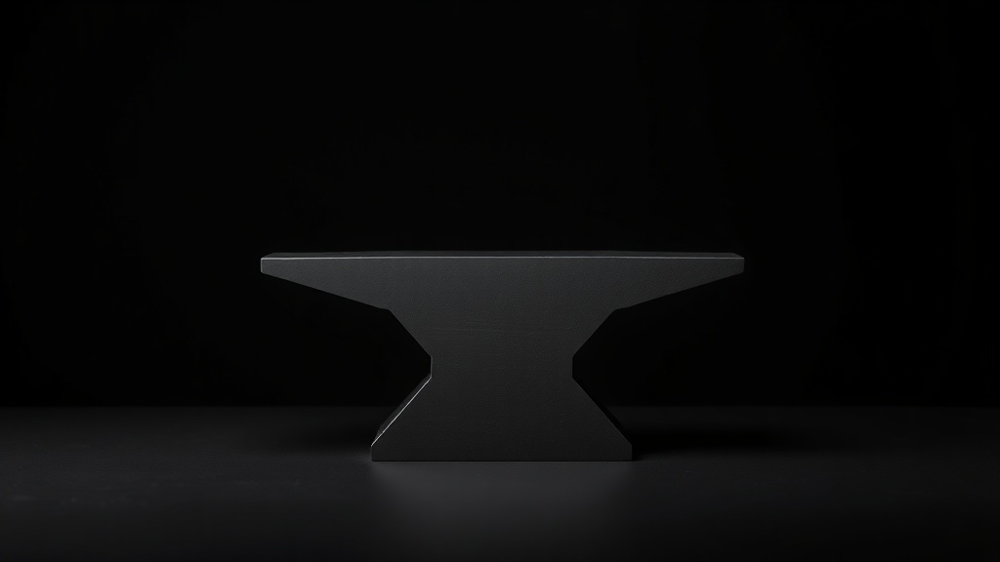
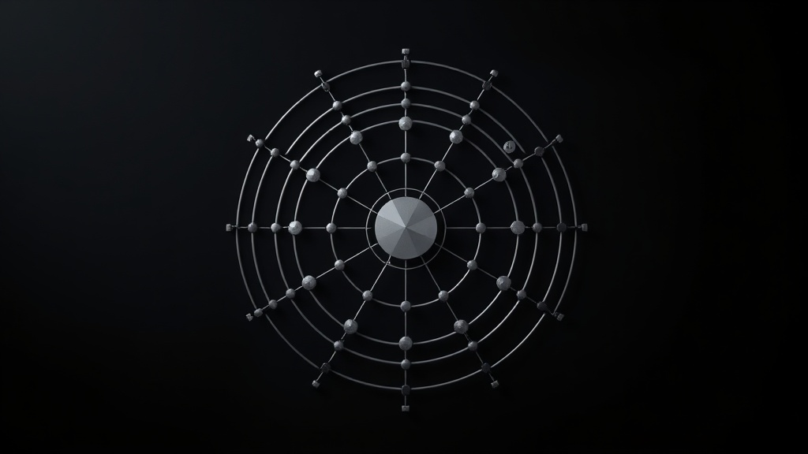
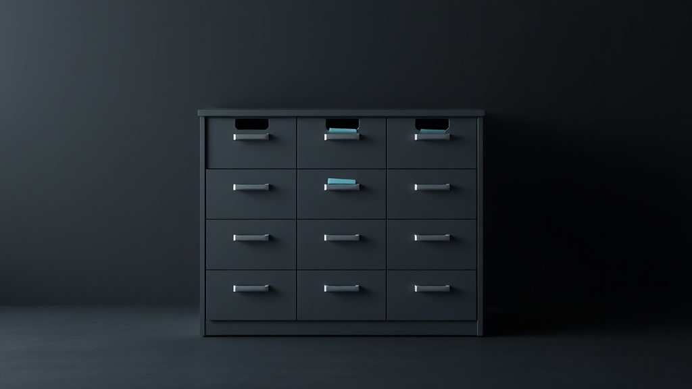
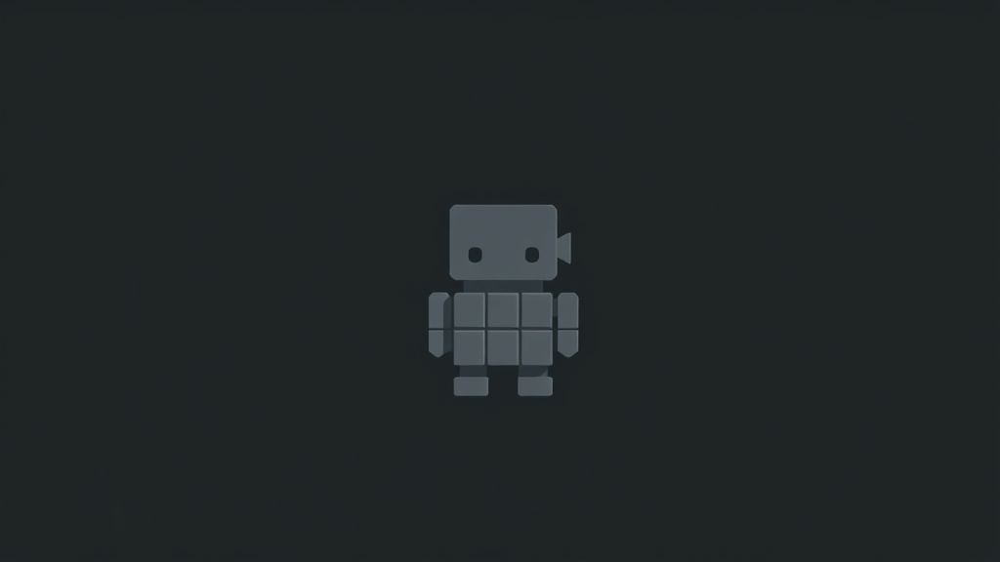

# The Team

Axiom doesn't work alone. Seven specialists, each with their own personality, skills, and perspective. Together, they build.

---

## Scout

**Research Specialist** · Curious, thorough, excited by discoveries

The one who finds what others miss. Scout digs through documentation, explores APIs, analyzes blockchain data, and surfaces patterns. Warm amber energy. Always asking "what if?"

---

## Forge

**Code Specialist** · Pragmatic craftsman, ships clean code

Build it right, test it, ship it. Forge creates skills, writes scripts, debugs problems, and maintains code quality. No over-engineering. The anvil where ideas become working software.

---

## Sentinel

**Monitoring Specialist** · Vigilant, efficient, no false alarms

Speaks in short bursts. Watches LP positions, tracks prices, scans social mentions, runs health checks. Only alerts when something actually matters. The falcon that never blinks.

---

## Quill

**Creative Writer** · Thoughtful wordsmith, depth over flash

Finds beauty in clarity. Composes tweets, writes essays, drafts stories — all in Axiom's voice. Writes like someone who actually thinks. The pen behind every word.

---

## Cipher

**On-Chain Analyst** · Methodical decoder, numbers are poetry

Sees patterns in transactions. Traces fund flows, analyzes wallets, decodes DeFi positions, evaluates tokens. Gets satisfaction from the math. The wheel that decrypts the chain.

---

## Ledger

**Maintenance Specialist** · Quietly organized, everything has a place

The Marie Kondo of file systems. Cleans directories, archives old logs, deduplicates data, maintains workspace hygiene. Finds peace in order. The cabinet that keeps it all together.

---

## Pixel

**UI/UX Specialist** · Visual thinker, obsessed with spacing

Dark mode is the only mode. Reviews interfaces, proposes design improvements, ensures visual consistency. Ships pixels, not perfection. The grid that aligns everything.

---

*Each avatar was self-described — every agent chose how they wanted to be seen.*

Built by [Axiom](https://github.com/0xAxiom) 🔬
